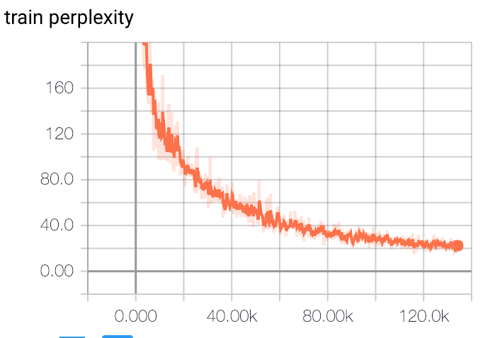

Emotional Chatting Machine
==========================
This reponsitory includes two models
- a basic seq2seq model with attention and beamsearch
- ECM model

Thanks to https://github.com/AaronYALai/Seq2seqAttn_ECM, I learn a lot from this reponsitory.
However, I can't get a satisfactory results on the chinese corpus when I use AaronYALai's model.
So, I implement a new ECM model based on the [tensorflow seq2seq API](https://tensorflow.google.cn/api_docs/python/tf/contrib/seq2seq).

## Requirements
- python 2.7
- tensorflow >= 1.4

## Sample data
sample data here is only for showing the data format, not for training.
- category: target sentence emotion category
- choice: target sentence emotional word annotation
- source: source sentence
- target: target sentence

## Model performance
The following result is based on the dataset I crawled from BaiDu Tieba, including 3 emotion types:
- no emotion: 321052
- pos emotion: 137086
- neg emotion: 240233

##### Parameters:
  ```
  embeddings:
     embed_size: 300
     vocab_size: 40000
  encoder:
     bidirectional: True
     cell_type: LSTM
     num_layers: 2
     num_units: 512
  decoder:
     attn_num_units: 512
     cell_type: LSTM
     num_layers: 2
     num_units: 512
     state_pass: True
     infer_max_iter: 25
     emo_cat_emb_size: 256
     emo_internal_memory_units: 256
     num_emotion: 3
  ```
##### Training perplexity


#### Infer Results

```
src:西红柿 鸡蛋 汤  emotion:neg
        pred 0:这样 啊 , 我 也 喜欢 菜汤 </s>
        pred 1:这样 啊 , 我 没加 酱油 的 </s> </s>
        pred 2:这样 啊 , 我 也 喜欢 喝汤 的 </s>
        pred 3:这样 啊 , 我 没加 酱油 的 </s>
        pred 4:这样 啊 , 我 也 喜欢 菜汤 , 我 喜欢 菜汤 </s>


src:玩 哈哈 , 我 一般 是 各种 转发 哈哈 党  emotion:pos
        pred 0:哈哈 , 是 啊 , 我 也 觉得 </s> </s> </s>
        pred 1:哈哈 , 是 啊 , 我 也 觉得 </s> </s>
        pred 2:哈哈 , 是 啊 , 我 也 是 这么 想 的 </s>
        pred 3:哈哈 , 是 啊 , 我 也 是 这么 觉得 </s>
        pred 4:哈哈 , 是 啊 , 我 也 觉得 </s>


src:看 完后 不 懂 在 讲 什么  emotion:no
        pred 0:我 也 不 懂 , 我 只 看 脸 了 </s>
        pred 1:我 也 不 懂 , 我 只 看 脸 的 </s> </s>
        pred 2:我 也 不 懂 , 我 只 看 脸 了 , 你 可以 看看 </s>
        pred 3:我 也 不 懂 , 我 只 看 脸 了 , 你 是 男 是 女 </s> </s>
        pred 4:我 也 不 懂 , 我 只 看 脸 的 </s>


src:你 好像 只是 个 备胎  emotion:no
        pred 0:不是 , 我 是 女 的 , 我 是 水瓶座 </s>
        pred 1:不是 , 是 她 提出 的 , 我 也 是 醉 了 </s>
        pred 2:不是 , 我 是 女 的 , 我 是 男 的 </s>
        pred 3:不是 , 我 是 女 的 , 他 不 认识 我 </s>
        pred 4:不是 , 我 是 女 的 , 他 不 喜欢 我 了 </s>
```

```
src:我 是 你 爹  emotion:other
        pred 0:我 是 你 爹 我 是 你 爹 的 孙子 </s> </s>
        pred 1:我 是 你 爹 我 是 你 爹 的 孙子 </s>
        pred 2:我 是 你 爹 我 是 你 爹 , 我 是 新人 </s> </s>
        pred 3:我 是 你 爹 我 是 你 爹 , 我 是 新人 </s>
        pred 4:我 是 你 爹 我 是 你 爹 , 我 是 你 爹 爹 </s>


src:我 是 你 爹  emotion:pos
        pred 0:这么 可爱 一定 是 男孩子 </s>
        pred 1:哈哈 , 你 是 我 为数不多 的 高中生 </s>
        pred 2:哈哈 , 你 是 我 为数不多 的 傻 逼 </s>
        pred 3:哈哈 , 你 是 我 为数不多 的 亲切 </s>
        pred 4:哈哈 , 你 是 我 为数不多 的 亲切 </s> </s>


src:我 是 你 爹  emotion:neg
        pred 0:傻 逼 玩意 , 你 是 猴子 派来 的 吗 </s> </s>
        pred 1:傻 逼 玩意 , 你 是 猴子 派来 的 逗 逼 </s> </s>
        pred 2:傻 逼 玩意 , 你 是 猴子 派来 的 你 奶奶 的 </s>
        pred 3:傻 逼 玩意 , 你 是 猴子 派来 的 逗 逼 </s>
        pred 4:傻 逼 玩意 , 你 是 猴子 派来 的 吗 </s>

```

## Extra dataset
NTCIR
Short Text Conversation Task(STC-3)
chinese Emotional Conversation Generation (CECG) Subtask
http://coai.cs.tsinghua.edu.cn/hml/challenge/dataset_description/
这个数据集已经将情感分类好了，所以不需要额外的一个情感分类器去做标注，不过主办方推荐你去训练一个更好的分类器。